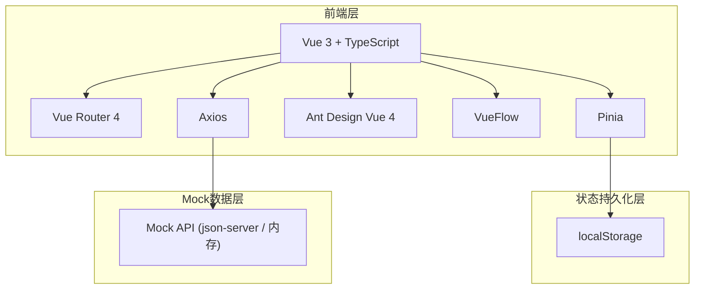

## 1. 架构设计



纯前端架构，使用 Pinia + localStorage 实现数据持久化，Axios 调用内存中的 Mock API。

## 2. 技术说明

- 前端：Vue 3 + TypeScript + Vite
- 初始化工具：vite-init (vue-ts 模板)
- 流程画布：@vue-flow/core + @vue-flow/background + @vue-flow/controls + @vue-flow/minimap
- 状态管理：Pinia + pinia-plugin-persistedstate
- UI 框架：Ant Design Vue 4
- 路由：Vue Router 4
- 样式：Less
- 请求：Axios（配合 Mock 适配器）
- 数据持久化：localStorage
- 图标：@ant-design/icons-vue

## 3. 路由定义

| 路由 | 用途 | 组件 |
|------|------|------|
| / | 首页重定向到流程列表 | - |
| /flows | 流程列表页 | FlowList |
| /flows/designer/:id | 流程设计器页 | FlowDesigner |
| /apply | 发起申请页 | ApplyForm |
| /todo | 我的待办页 | TodoList |
| /done | 我的已办页 | DoneList |
| /mine | 我发起的页 | MineList |
| /application/:id | 审批详情页 | ApplicationDetail |

## 4. API 定义（Mock）

### 4.1 流程定义 API

```typescript
interface FlowDefinition {
  id: string
  name: string
  status: 'draft' | 'published'
  nodes: FlowNode[]
  edges: FlowEdge[]
  createdAt: string
  updatedAt: string
}

interface FlowNode {
  id: string
  type: 'start' | 'approver' | 'end'
  label: string
  position: { x: number; y: number }
  data: {
    approverType?: 'user' | 'role' | 'manager'
    approverIds?: string[]
  }
}

interface FlowEdge {
  id: string
  source: string
  target: string
}

// GET    /api/flows          - 获取流程列表
// GET    /api/flows/:id      - 获取流程详情
// POST   /api/flows          - 创建流程
// PUT    /api/flows/:id      - 更新流程
// DELETE /api/flows/:id      - 删除流程
// PUT    /api/flows/:id/publish - 发布流程
```

### 4.2 申请实例 API

```typescript
interface Application {
  id: string
  flowId: string
  flowName: string
  title: string
  description: string
  applicantId: string
  applicantName: string
  status: 'pending' | 'approved' | 'rejected'
  currentNodeId: string
  createdAt: string
  updatedAt: string
}

// GET    /api/applications           - 获取申请列表
// GET    /api/applications/:id       - 获取申请详情
// POST   /api/applications           - 发起申请
// GET    /api/applications/todo      - 获取我的待办
// GET    /api/applications/done      - 获取我的已办
// GET    /api/applications/mine      - 获取我发起的
```

### 4.3 审批记录 API

```typescript
interface ApprovalRecord {
  id: string
  applicationId: string
  nodeId: string
  nodeName: string
  approverId: string
  approverName: string
  action: 'approve' | 'reject'
  comment: string
  createdAt: string
}

// GET  /api/applications/:id/records - 获取审批历史
// POST /api/applications/:id/approve - 同意
// POST /api/applications/:id/reject  - 驳回
```

### 4.4 用户/角色 Mock 数据

```typescript
interface User {
  id: string
  name: string
  role: string
}

interface Role {
  id: string
  name: string
}

// 预置用户：张三(CEO)、李四(经理)、王五(主管)、赵六(员工)、孙七(财务)
// 预置角色：CEO、部门经理、主管、员工、财务
// 当前登录用户：赵六(员工)
```

## 5. 状态管理设计

### 5.1 Pinia Store 划分

| Store | 职责 |
|-------|------|
| useFlowStore | 流程定义的 CRUD、流程发布、流程校验 |
| useApplicationStore | 申请实例管理、审批操作 |
| useUserStore | 当前用户信息、用户列表、角色列表 |

### 5.2 数据持久化策略

- useFlowStore：持久化到 localStorage（流程定义数据）
- useApplicationStore：持久化到 localStorage（申请与审批记录）
- useUserStore：不持久化（固定 Mock 数据）

## 6. 项目目录结构

```
src/
├── assets/              # 静态资源
│   └── styles/          # 全局样式
│       └── variables.less
├── components/          # 公共组件
│   └── AppLayout.vue    # 应用布局（侧边栏+内容区）
├── composables/         # 组合式函数
│   └── useFlowValidation.ts  # 流程校验逻辑
├── mock/                # Mock 数据
│   ├── users.ts         # 用户与角色数据
│   └── index.ts         # Mock API 注册
├── pages/               # 页面组件
│   ├── FlowList.vue     # 流程列表
│   ├── FlowDesigner/    # 流程设计器
│   │   ├── index.vue    # 设计器主页面
│   │   ├── NodePanel.vue    # 左侧节点面板
│   │   ├── PropertyPanel.vue # 右侧属性面板
│   │   └── nodes/       # 自定义节点组件
│   │       ├── StartNode.vue
│   │       ├── ApproverNode.vue
│   │       └── EndNode.vue
│   ├── ApplyForm.vue    # 发起申请
│   ├── TodoList.vue     # 我的待办
│   ├── DoneList.vue     # 我的已办
│   ├── MineList.vue     # 我发起的
│   └── ApplicationDetail.vue # 审批详情
├── router/              # 路由配置
│   └── index.ts
├── stores/              # Pinia Store
│   ├── flow.ts
│   ├── application.ts
│   └── user.ts
├── types/               # TypeScript 类型定义
│   └── index.ts
├── App.vue
└── main.ts
```

## 7. 流程校验算法

```
1. 检查开始节点数量 === 1
2. 检查结束节点数量 === 1
3. 使用 BFS/DFS 从开始节点遍历，检查是否可达结束节点
4. 遍历过程中检测环路（记录访问路径）
5. 检查是否所有节点都被访问到（无孤立节点）
6. 检查所有审批节点是否配置了审批人
```
